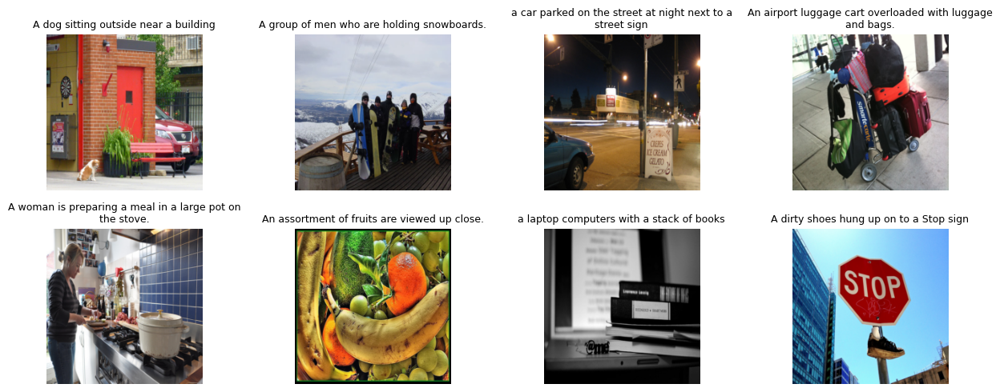

# Caption Generation with Transformers

This project demonstrates the development and implementation of various image captioning techniques using deep learning models, with a focus on transformer-based architectures.

## Project Overview

This repository contains implementations of different neural network approaches for automatic image caption generation, including RNN-based models and modern transformer architectures. The project showcases the evolution of caption generation techniques and provides practical implementations for research and learning purposes.

## Installation

1. Clone the repository:
```bash
git clone https://github.com/raj-neelam/Caption-generation-with-transformers.git
cd Caption_generation
```

2. Install the required dependencies:
```bash
pip install -r requirements.txt
```

## Project Structure

### 📁 Notebooks
- **`Caption_RNN.ipynb`** - Implementation of RNN/LSTM-based image captioning model
- **`Caption_ViT.ipynb`** - Vision Transformer (ViT) based captioning approach
- **`Caption_Transformer.ipynb`** - Full transformer architecture for image captioning

### 📁 Models
- **`models/`** - Directory containing model definitions and architectures
- **`models/models.md`** - Documentation for different model architectures and their specifications

### 📁 Data
- **`data/`** - Dataset directory for training and testing images
- **`data/output.png`** - Sample output demonstrating caption generation results:



## Features

- **Multiple Architectures**: Compare RNN, ViT, and Transformer approaches
- **Pre-trained Models**: Utilizes state-of-the-art pretrained vision and language models
- **Comprehensive Evaluation**: Includes metrics and visualization for model performance
- **GPU Support**: Optimized for CUDA-enabled systems
- **Tensorboard Integration**: Track training progress and experiments

## Usage

Each notebook can be run independently to explore different captioning approaches:

1. **RNN Approach**: Start with `Caption_RNN.ipynb` for traditional sequence-to-sequence captioning
2. **Vision Transformer**: Use `Caption_ViT.ipynb` for modern vision-based encoding
3. **Full Transformer**: Explore `Caption_Transformer.ipynb` for end-to-end transformer architecture

## Model Performance

The transformer-based models typically achieve state-of-the-art performance on standard captioning benchmarks, with improvements in:
- **BLEU Scores**: Better n-gram overlap with reference captions
- **CIDEr Scores**: Improved consensus-based evaluation
- **Semantic Coherence**: More meaningful and contextually relevant captions

## Dependencies Notes

- The project requires CUDA-compatible GPU for optimal performance
- All models are compatible with PyTorch 2.10+ and torchvision 0.25+
- The transformer implementations leverage Hugging Face's transformers library

## Contributing

Feel free to contribute by:
- Adding new model architectures
- Improving existing implementations
- Adding evaluation metrics
- Enhancing documentation

## License

This project is for educational and research purposes. Please refer to individual model licenses for usage restrictions.
